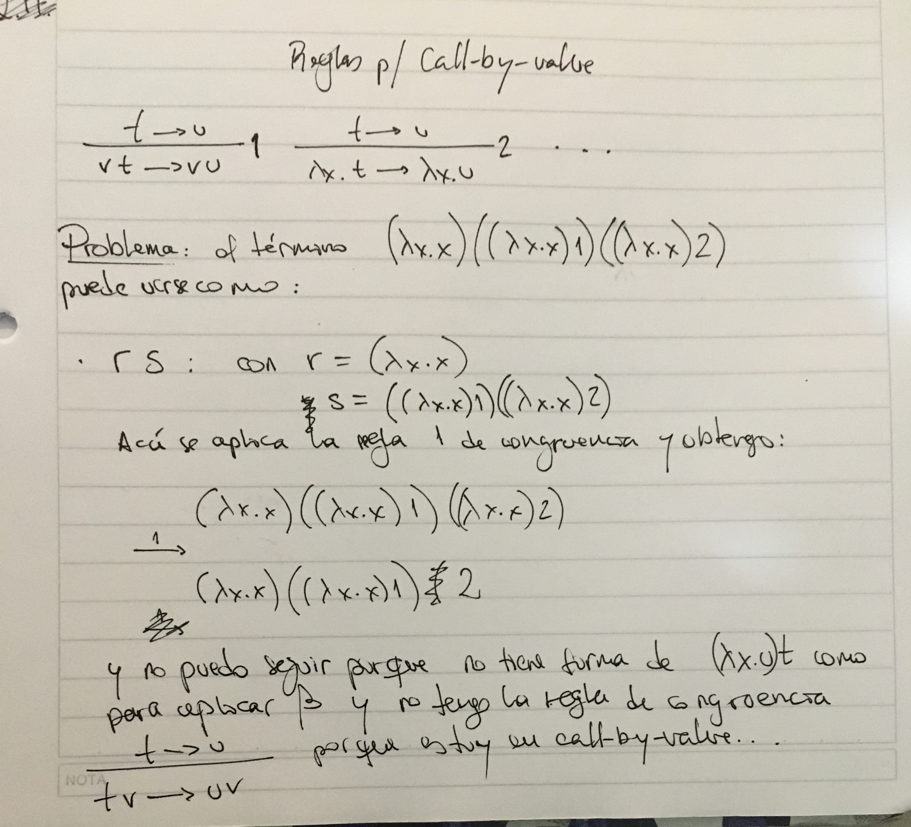
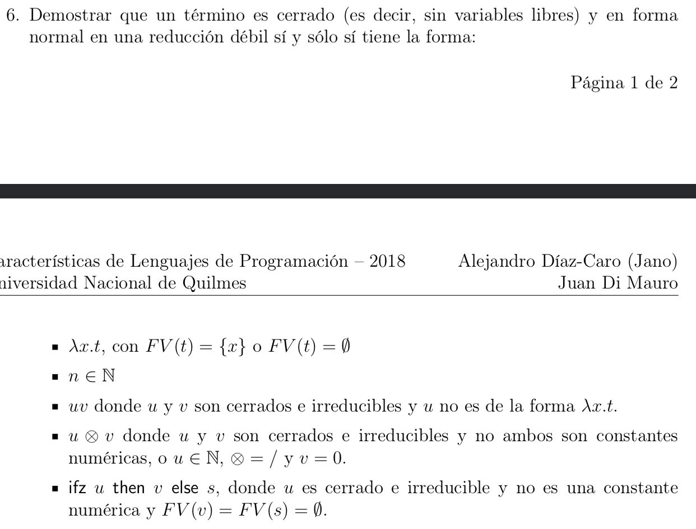
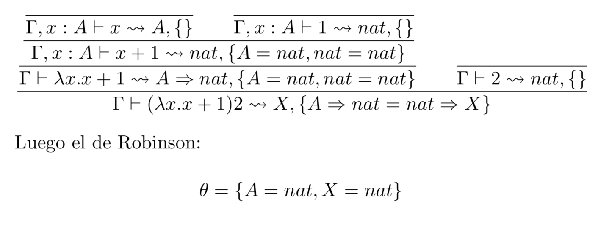
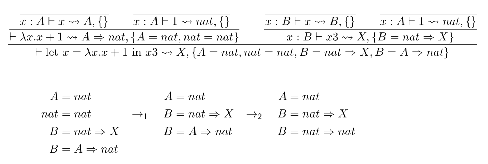
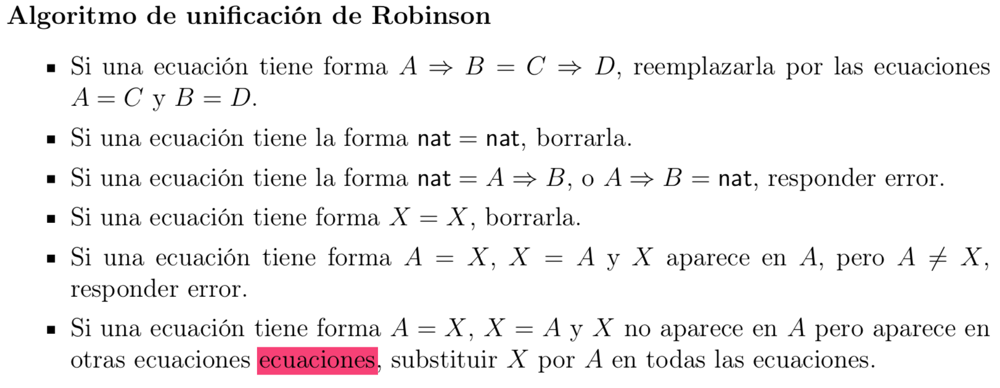

#### Duda 1

Te paso una duda que me está atormentando. En tu apunte vos proponés como ejercicio definir las reglas de reducción y congruencia en call-by-value. Lo tengo escrito en el cuaderno, te paso foto. Si no se entiende te lo pongo más prolijo.

(A las reglas de reducción las dejé igual)

#### Duda 2

Agrego pregunta. Estoy haciendo el ejercicio 6 de la práctica 2:

Encaré la demostración hacia ambos lados de la equivalencia por inducción, pero me queda medio explosiva porque en cada caso al aplicar HI me queda que u y v pueden tener cualquiera de las formas, y debería analizar cada combinación de formas para probar que efectivamente t = uv (o el caso que sea) efectivamente es cerrado, irreducible y tiene alguna de las formas mencionadas. Como usualmente, calculo que algo se me está escapando.

#### Duda 3

Sigo con las preguntas. Estoy resolviendo la práctica de inferencia. El ejercicio 1 pide dar el tipo principal, y todos los tipos, de los términos. El 1.b es `(\x.x+1)2`. Aplicando Hindley y Robinson me quedó:

¿Qué sería acá "el tipo principal" y "todos los tipos"?

#### Duda 4

Bien. Te paso otro:

No me queda clara la diferencia entre A,B,C,... y X en la definición del algoritmo de Hindley+Robinson. ¿A,B,C,... se refieren a un tipo concreto pero que no conozco, y X se refiere a cualquier tipo? Aunque fuera así, tampoco me terminaría de quedar claro. Por ejemplo, en →2 , ¿está bien aplicado el último caso de la definción de Robinson? ¿Puedo entender a A como X y a nat como A?

